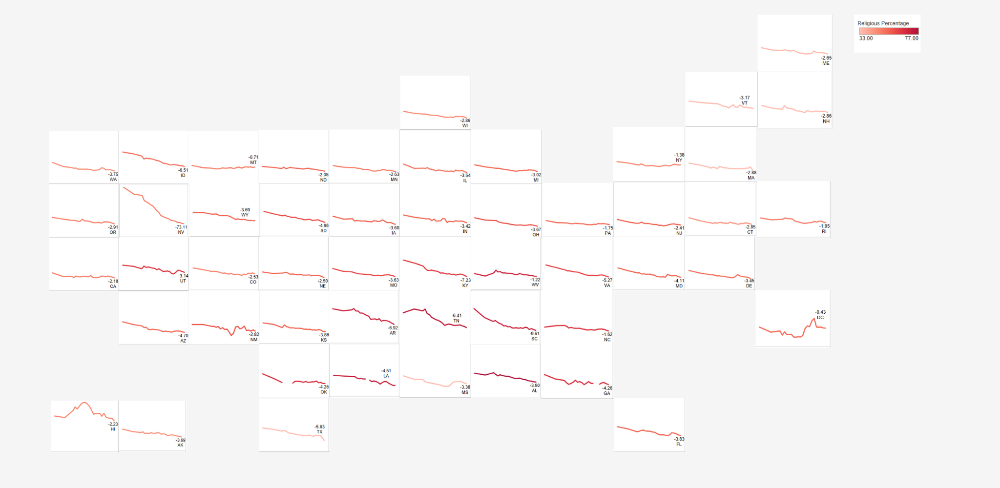
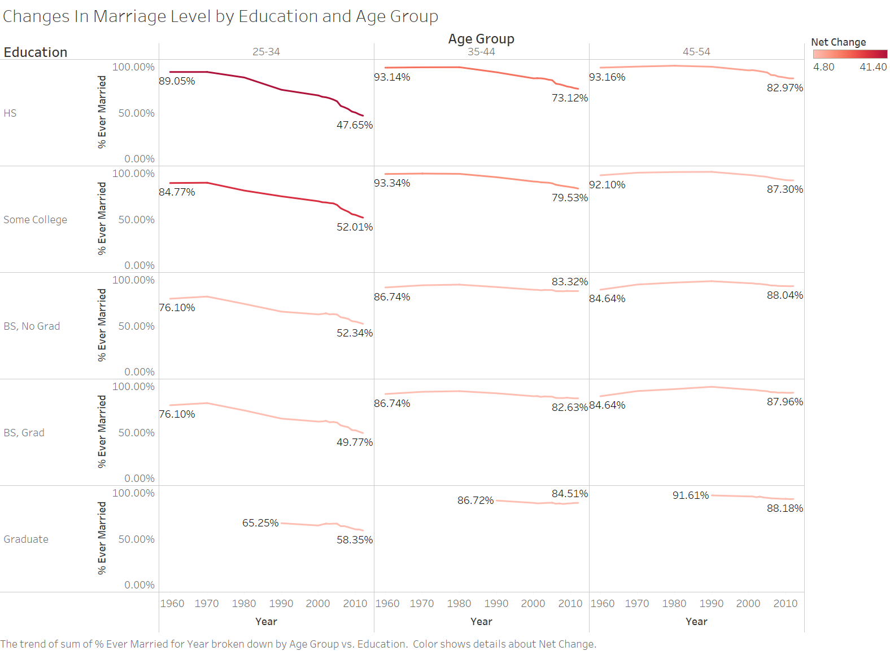
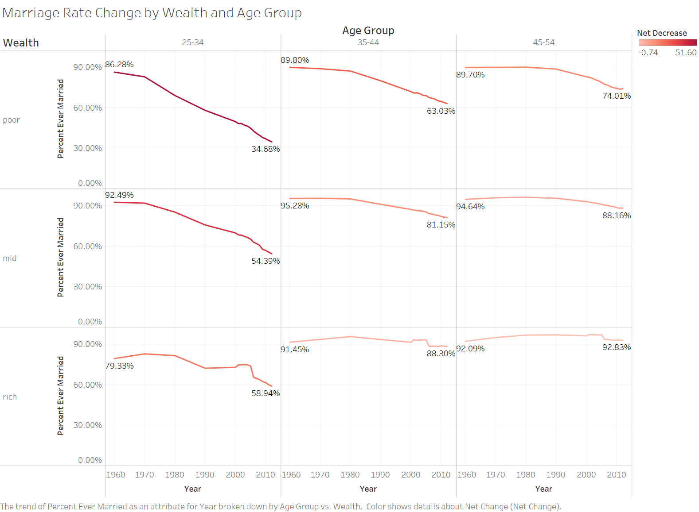
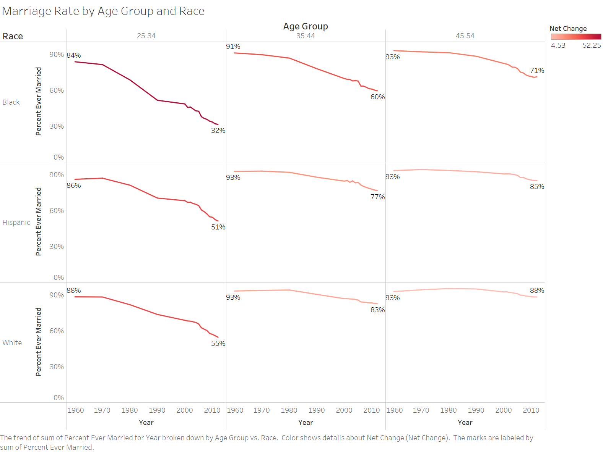
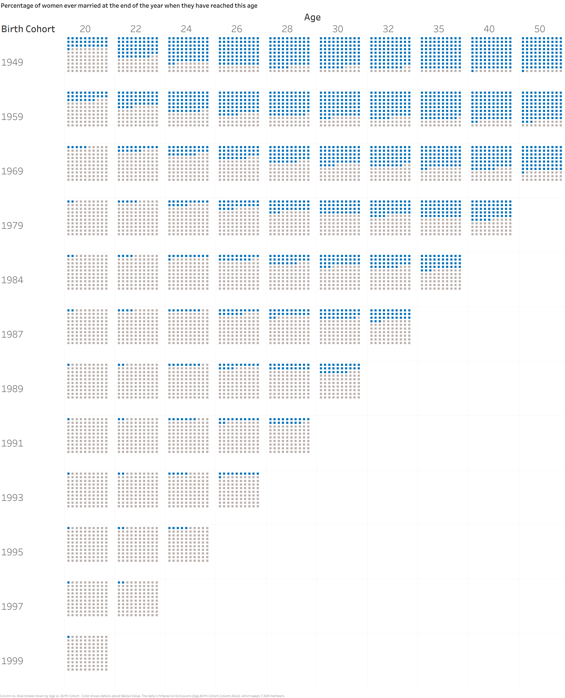
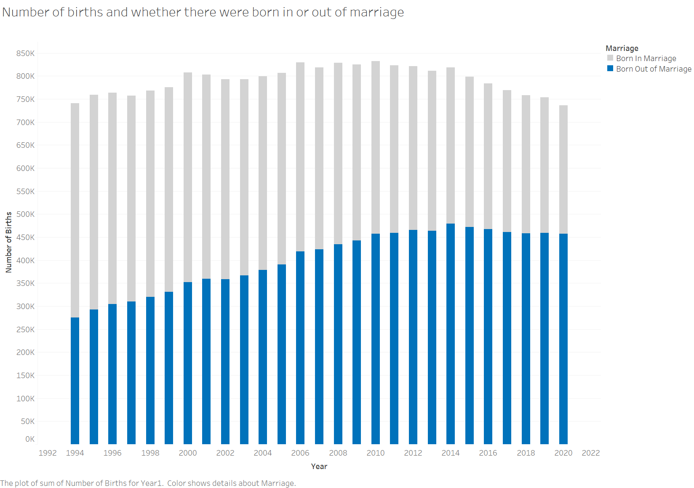

By Sanghavi Gaddam and Ravi Singhal

## Introduction 

Getting married is often one of the most important decisions someone can make in their lives. The purpose of marriage can be vastly different depending on the culture, ranging from love to business to social connections.To this day, the role of marriage is constantly evolving all around the world. Generally, marriage rates are decreasing around the globe for a variety of reasons. For example, some reasons driving down marriage rates are people are getting married at an older age and the perceived value of marriage is decreasing. By taking a closer look at three unique countries, we can gain insights into why global marriages are on a downward trend despite the role of marriage varying so much across cultures. In the United States, demographic factors like race and income are highly correlated with marriage rates. In India, the average age when a person is married is increasing, particularly in states that are more progressive. In France, childbearing and marriage are becoming increasingly decoupled, as people are no longer finding marriage to be an important prerequisite to having a child. When put together, these three cases give us some perspective on how the global perception of marriage is shifting.

<iframe seamless frameborder="0" src="https://public.tableau.com/views/Global_marriage/Sheet1?:embed=true&:showVizHome=no" width = '650' height = '450' scrolling='yes' ></iframe>

Source: Esteban Ortiz-Ospina and Max Roser (2020) - "Marriages and Divorces". Published online at OurWorldInData.org. Retrieved from: 'https://ourworldindata.org/marriages-and-divorces' [Online Resource]

## United States - Marriage Isn’t the Same for Everyone

Marriage is on the decline in the United States. But is that true for everyone and everywhere? 

### Geographic Differences
Marriage Rate By State in the United States 
{:height="100%" width="100%"}
Note: Marriage rate is numeber of marriages per 1000 inhabitants. Y axis for Nevada ranges from 0 to 100, for other states it ranges from 0 to 20. X axis ranges from the year 1990 to 2019.
[Data Source](https://www.cdc.gov/nchs/nvss/marriage-divorce.htm?CDC_AA_refVal=https%3A%2F%2Fwww.cdc.gov%2Fnchs%2Fmardiv.htm)\
 
If we take a look at how the marriage rate (number of marriages per 1000 inhabitants in each state) has been declining across the United States from 1990 to 2019, it’s apparent that the decline is present country wide. Even states like Nevada, which is largely popular for its Vegas weddings, has seen a large decline over the past couple of years. A look into the religiosity of the different states also shows that the decline in marriage rates is happening regardless of the religiosity of the state. 

### The Education, Wealth, and Race Gap

{:height="100%" width="100%"}
[Data Source](https://github.com/fivethirtyeight/data/tree/master/marriage)\
 
More startling differences in marriage rates (% of people ever married) start to emerge when we begin to explore the impact different demographic factors have. While a greater percentage of young people across all education levels are choosing not to get married, those with only a high school education have seen the largest decline in marriage rate. For many other education levels, we see that this drop in marriage rate seems to level out by the next age group but for those with only a high school and some college education, this drop persists onwards. While those with higher education levels might be choosing to get married later in life, Americans with lower levels of education might forgo marriage entirely. 

{:height="100%" width="100%"}
[Data Source](https://github.com/fivethirtyeight/data/tree/master/marriage)\
 
America’s affluent are still choosing to get married at rates much higher than America’s poorest and it’s difficult to pinpoint exactly why that is. Increased access to contraception and increased engagement in the labor force helped empower women to see marriage as less of necessity for survival. However, the factors should have pushed middle and upper classes away from marriage, so why hasn’t it?

Economist Robert Pollack suggests that marriage can serve as a means of commitment that can enable an in investment children. This commitment between a couple allows for either parent to support the other as they work through difficulties of balancing their career and family life. Thus, marriage forms an essential component for successful middle and upper-class parenthood. 

Another theory put forth by sociologist Andrew Cherlin is that marriage can still serve as a social marker of achievement for your personal life. Thus, well off, college educated individuals might be more likely to feel as if they are in a successful position in life to get married. 

[Information Source](https://washingtonmonthly.com/magazine/maraprmay-2016/why-is-marriage-thriving-among-and-only-among-the-affluent/)

{:height="100%" width="100%"}
[Data Source](https://github.com/fivethirtyeight/data/tree/master/marriage)\
 
Another demographic factor that has a major impact on marriage rate is race. Here the group that has seen the largest decline in marriage rate is young, black Americans. Social scientists haven’t been able to fully account for the differences in marriage patterns across the different races that are seen here but there have been many attempts. One hypothesis for the dips in marriage rates for black Americans in the 70s and 80s was put forth by sociologists William Julius Wilson and Kathryn Neckerman. They proposed that black men were hit particularly hard by the unemployment brought on by a decline in unskilled manufacturing jobs during this time period. This factor combined with a higher incarceration rate and higher death rates among black men in comparison white men left a smaller and smaller pool of black men for black women to marry which may have spurred the apparent race gap in marriage rates. 

Another potential explanation turns to the education gap between black men and women. Women often prefer partners with similar levels of educational background. There is already an education gap between women and men in the US today, with young women on average being more educated than young men. This gap widens more for young black women and men which could potentially decrease the pool of marriable men for black women. Another factor that could also be in play is that black men tend to marry outside of their race at two times the rate that black women do, further decreasing the size of the pool.

[Information Source](https://www.ncbi.nlm.nih.gov/pmc/articles/PMC4850739/)

### Explore the Factors
<iframe seamless frameborder="0" src="https://public.tableau.com/views/Alldifferences/Sheet1?:embed=true&:showVizHome=no" width = '650' height = '450' scrolling='yes' ></iframe> 
[Data Source](https://github.com/fivethirtyeight/data/tree/master/marriage)

   

## India - A Nation of Many Cultures

<iframe seamless frameborder="0" src="https://public.tableau.com/views/IndiaChildMarriage/Sheet1?:embed=true&:showVizHome=no" width = '650' height = '450' scrolling='yes' ></iframe> 

Source: Sonalde Desai, Department of Sociology, University of Maryland, 2112 Art-Sociology Building, College Park, MD 20742; and National Council for Applied Economic Research, New Delhi 110 002, India. E-mail: ude.dmu.ycos@iaseds; gro.reacn@iaseds \
[Data Source](http://mospi.nic.in/sites/default/files/reports_and_publication/statistical_publication/social_statistics/Chapter_3.pdf)

When some people think of marriage in India, two of the first terms that might pop into their heads are “arranged marriages” and “child marriages”. While India  still possesses some of the world’s highest rates of these types of marriages, the Indian state has a strong influence on the social and cultural norms surrounding marriage. The above plots show how the proportion of people married before age 16 and the mean age of marriage are correlated with various social factors. We focused on four social factors: mean score on immobility index, proportion of women in wage employment, proportion of homes where men and women eat separately, and literacy rate. The immobility index measures how difficult it is to move up or down socioeconomic classes in a given society. When looking at the graphs we can see some definite trends in the data. 

The state of Kerala is known to be one of the most progressive states in India. This idea is reinforced by Kerala having the highest literacy rate of any state in 2001. Kerala also owns the highest mean age at marriage and lowest proportion marriage by age 16. We can see downward trends when mean age at marriage is plotted against mean score on immobility index and proportion of homes where men and women eat separately and upward trends proportion married by age 16 is plotted against those same two factors. Kerala ranks at the extreme ends for all of these plots while a more traditional state like Bihar lies at the opposite end of the graph. Interestingly, the proportion of women in wage employment does not have a strong trend, implying it is not correlated with the mean age of marriage or proportion married by age 16. All of the states in the North region are clustered together in every graph, meaning the Northern states tend to be similar culturally and they lie on the progressive side of the country. Additionally, when looking at just the Southern states, they lie very close to a straight line, further reinforcing the idea that these features are correlated. However, when examining the rest of the regions, their states are spread out through the remainder of the graph, lacking any trend with respect to region. The strongest trends appear on the literacy rate graphs, as the earlier people are married, the lower literacy rate the state has. Overall, while India as a whole may have a reputation for high rates of child marriages, in reality each state varies greatly in the social role of marriage.

   

## France - The Decoupling of Childbearing and Marriage 

It is common to think about marriage and having children as important steps towards the idea of 
“building a family”. However, there have been trends in some countries that are dismantling this idea. Here, we take a look at how marriage and childbearing have changed in France over the past couple of decades. 

{:height="100%" width="100%"}
[Data Source](https://www.insee.fr/en/statistiques/5015913?sommaire=5015923&q=Nuptiality)\
Each square represents 1 percent of the women population. Blue represents married and gray represents unmarried. 
 
The chart above shows how the percentage of women ever being married has changed over time. At first, shifts show that women are choosing to get married later and later. However, for more recent birth cohorts, an increasing proportion are choosing to not get married at all. 

### The baby-making champion of Europe 
<iframe seamless frameborder="0" src="https://public.tableau.com/views/fertilityrates_16197003498590/Sheet1?:embed=true&:showVizHome=no" width = '650' height = '450' scrolling='yes' ></iframe>
<iframe seamless frameborder="0" src="https://public.tableau.com/views/fertilityrates_16197003498590/Sheet2?:embed=true&:showVizHome=no" width = '650' height = '450' scrolling='yes' ></iframe>
[Data Source](https://www.insee.fr/fr/statistiques/3303349?sommaire=3353488#titre-bloc-3)\
 
Despite French women being more reluctant to get married, they still on average have the highest fertility rate in the EU. They are also fair middle of the pack when it comes to the age at which they have children. French women are choosing not to get married but they’re still having children, so what’s going on?

### The increasing popularity of having children out of wedlock 
{:height="100%" width="100%"}
[Data Source](https://www.insee.fr/fr/statistiques/2381394#tableau-figure1)\
 
While the number of births in France has remained relatively stable in France over the past couple of decades, what has changed drastically is the percentage of births that happen out of wedlock. This figure has grown from 37% in 1994 to 62% in 2020. This highlights one of the biggest shifts in social attitudes in France towards marriage - that it isn’t a necessary first step for parenthood. This trend highlights just how quickly changes in social patterns can emerge. 

